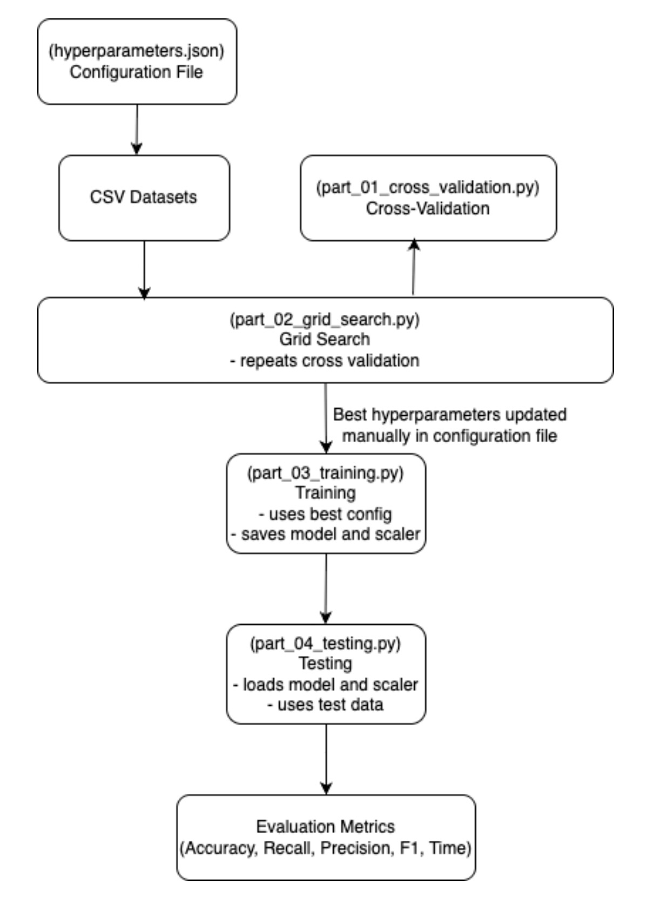

# Binary Classification ML Pipeline

A comprehensive machine learning pipeline for binary classification tasks, featuring automated hyperparameter optimization and model evaluation across multiple classifiers.

## Overview

This project implements a complete machine learning workflow with cross-validation, grid search, training, and testing capabilities. It supports three popular classification algorithms:

- **Decision Tree Classifier**
- **Random Forest Classifier**
- **Logistic Regression**

## Architecture



The diagram above illustrates the complete workflow from configuration to final evaluation metrics.

## Features

- **Cross-Validation**: K-fold cross-validation for robust model evaluation
- **Grid Search**: Automated hyperparameter tuning to find optimal configurations
- **Modular Architecture**: Clean separation of concerns with reusable auxiliary functions
- **Multiple Dataset Support**: Scalable from small to very large datasets
- **Standardized Preprocessing**: Automatic feature scaling using StandardScaler
- **Model Persistence**: Save and load trained models and scalers

## Project Structure

```
├── auxiliary_functions.py          # Core helper functions for data processing and training
├── part_01_cross_validation.py     # K-fold cross-validation implementation
├── part_02_grid_search.py          # Hyperparameter grid search
├── part_03_training.py             # Final model training
├── part_04_testing.py              # Model evaluation on test data
├── hyperparameters.json            # Configuration file for hyperparameters
├── training_data_*.csv             # Training datasets (small, medium, large, very_large)
└── testing_data.csv                # Testing dataset
```

## Requirements

```bash
pip install numpy pandas scikit-learn
```

## Usage

### 1. Cross-Validation

Evaluate a classifier configuration using k-fold cross-validation:

```bash
python part_01_cross_validation.py hyperparameters.json training_data_small.csv 5
```

**Arguments:**

- Configuration file (JSON)
- Training data file (CSV)
- Number of folds (integer ≥ 2)

### 2. Grid Search

Find the best hyperparameters across all classifiers and datasets:

```bash
python part_02_grid_search.py hyperparameters.json training_data_{}.csv 5
```

**Arguments:**

- Configuration file (JSON)
- Training data filename pattern (use `{}` as placeholder for dataset size)
- Number of folds (integer ≥ 2)

The grid search will automatically test all combinations of hyperparameters defined in the configuration file and output the best configuration for each classifier type.

### 3. Training

Train the final model using optimized hyperparameters:

```bash
python part_03_training.py hyperparameters.json training_data_large.csv scaler_lr.pkl classifier_lr.pkl
```

**Arguments:**

- Configuration file (JSON)
- Training data file (CSV)
- Output scaler file (PKL)
- Output classifier file (PKL)

### 4. Testing

Evaluate the trained model on test data:

```bash
python part_04_testing.py testing_data.csv scaler_lr.pkl classifier_lr.pkl
```

**Arguments:**

- Test data file (CSV)
- Input scaler file (PKL)
- Input classifier file (PKL)

## Configuration

The `hyperparameters.json` file controls all aspects of the pipeline:

```json
{
  "active_classifier": "logistic_classifier",
  "hyperparameters": {
    "cross_validation": { ... },
    "grid_search": { ... },
    "training": { ... }
  }
}
```

- **active_classifier**: Specifies which classifier to use (`decision_tree`, `random_forest`, or `logistic_classifier`)
- **cross_validation**: Hyperparameters for validation experiments
- **grid_search**: Hyperparameter ranges to explore
- **training**: Final hyperparameters for production model

## Data Format

Input CSV files should follow this format:

- Rows: Individual samples
- Columns: Features (all columns except last)
- Last column: Binary labels
- Categorical values: "Yes"/"No" are automatically converted to 1/0

## Workflow Example

1. **Explore configurations with cross-validation:**

   ```bash
   python part_01_cross_validation.py hyperparameters.json training_data_medium.csv 5
   ```

2. **Run comprehensive grid search:**

   ```bash
   python part_02_grid_search.py hyperparameters.json training_data_{}.csv 5
   ```

3. **Update `hyperparameters.json` with best parameters from grid search**

4. **Train final model:**

   ```bash
   python part_03_training.py hyperparameters.json training_data_large.csv scaler.pkl classifier.pkl
   ```

5. **Evaluate on test set:**
   ```bash
   python part_04_testing.py testing_data.csv scaler.pkl classifier.pkl
   ```

## Performance Metrics

The pipeline reports comprehensive metrics including:

- Accuracy
- Precision, Recall, F1-Score (per class and averaged)
- Training and inference time
- Confusion matrix analysis

# Experimental Results

## Grid Search Results

### Decision Trees

| Dataset    | Criterion | Depth | Train Acc. | Val Acc. | Val Avg Rec. | Val Avg Prec. | Val Avg F1 | Time Train | Time Val |
| ---------- | --------- | ----- | ---------- | -------- | ------------ | ------------- | ---------- | ---------- | -------- |
| small      | entropy   | 2     | 0.8100     | 0.3600   | 0.4332       | 0.3879        | 0.3347     | 0.0024 s   | 0.0007 s |
| small      | entropy   | 4     | 0.8500     | 0.5400   | 0.5450       | 0.5500        | 0.5214     | 0.0019 s   | 0.0007 s |
| small      | entropy   | 8     | 1.0000     | 0.5400   | 0.5412       | 0.5540        | 0.5250     | 0.0017 s   | 0.0004 s |
| small      | entropy   | None  | 1.0000     | 0.5000   | 0.4955       | 0.4905        | 0.4848     | 0.0016 s   | 0.0004 s |
| small      | gini      | 2     | 0.7550     | 0.5200   | 0.5412       | 0.5778        | 0.5008     | 0.0016 s   | 0.0006 s |
| small      | gini      | 4     | 0.8950     | 0.4200   | 0.4260       | 0.4244        | 0.3922     | 0.0015 s   | 0.0003 s |
| small      | gini      | 8     | 1.0000     | 0.6400   | 0.6610       | 0.6636        | 0.6224     | 0.0014 s   | 0.0004 s |
| small      | gini      | None  | 1.0000     | 0.5200   | 0.5369       | 0.5267        | 0.5110     | 0.0014 s   | 0.0003 s |
| medium     | entropy   | 2     | 0.7100     | 0.5800   | 0.6072       | 0.6142        | 0.5634     | 0.0015 s   | 0.0004 s |
| medium     | entropy   | 4     | 0.8625     | 0.5900   | 0.5944       | 0.5961        | 0.5720     | 0.0018 s   | 0.0003 s |
| medium     | entropy   | 8     | 1.0000     | 0.6100   | 0.6198       | 0.6184        | 0.6074     | 0.0020 s   | 0.0004 s |
| medium     | entropy   | None  | 1.0000     | 0.5900   | 0.5862       | 0.5788        | 0.5747     | 0.0020 s   | 0.0004 s |
| medium     | gini      | 2     | 0.7300     | 0.5800   | 0.5837       | 0.5923        | 0.5639     | 0.0014 s   | 0.0003 s |
| medium     | gini      | 4     | 0.8750     | 0.5900   | 0.6073       | 0.6086        | 0.5865     | 0.0016 s   | 0.0004 s |
| medium     | gini      | 8     | 0.9950     | 0.5200   | 0.5178       | 0.5143        | 0.5056     | 0.0018 s   | 0.0004 s |
| medium     | gini      | None  | 1.0000     | 0.5400   | 0.5571       | 0.5554        | 0.5344     | 0.0021 s   | 0.0004 s |
| large      | entropy   | 2     | 0.6888     | 0.6100   | 0.6156       | 0.6478        | 0.5960     | 0.0019 s   | 0.0004 s |
| large      | entropy   | 4     | 0.7825     | 0.6400   | 0.6492       | 0.6588        | 0.6334     | 0.0023 s   | 0.0004 s |
| large      | entropy   | 8     | 0.9337     | 0.6500   | 0.6512       | 0.6523        | 0.6473     | 0.0031 s   | 0.0004 s |
| large      | entropy   | None  | 1.0000     | 0.6200   | 0.6180       | 0.6205        | 0.6173     | 0.0033 s   | 0.0004 s |
| large      | gini      | 2     | 0.6738     | 0.6300   | 0.6323       | 0.6574        | 0.6191     | 0.0017 s   | 0.0004 s |
| large      | gini      | 4     | 0.7925     | 0.6400   | 0.6422       | 0.6453        | 0.6358     | 0.0021 s   | 0.0004 s |
| large      | gini      | 8     | 0.9738     | 0.6350   | 0.6338       | 0.6336        | 0.6291     | 0.0027 s   | 0.0004 s |
| large      | gini      | None  | 1.0000     | 0.6450   | 0.6431       | 0.6431        | 0.6386     | 0.0028 s   | 0.0004 s |
| very_large | entropy   | 2     | 0.7205     | 0.7190   | 0.7190       | 0.7260        | 0.7156     | 0.0047 s   | 0.0004 s |
| very_large | entropy   | 4     | 0.7455     | 0.7350   | 0.7384       | 0.7420        | 0.7344     | 0.0070 s   | 0.0004 s |
| very_large | entropy   | 8     | 0.8360     | 0.6740   | 0.6727       | 0.6761        | 0.6711     | 0.0116 s   | 0.0005 s |
| very_large | entropy   | None  | 1.0000     | 0.6280   | 0.6282       | 0.6280        | 0.6278     | 0.0148 s   | 0.0005 s |
| very_large | gini      | 2     | 0.7208     | 0.7200   | 0.7172       | 0.7254        | 0.7150     | 0.0047 s   | 0.0005 s |
| very_large | gini      | 4     | 0.7452     | 0.7380   | 0.7340       | 0.7393        | 0.7340     | 0.0066 s   | 0.0005 s |
| very_large | gini      | 8     | 0.8615     | 0.6790   | 0.6780       | 0.6795        | 0.6767     | 0.0100 s   | 0.0005 s |
| very_large | gini      | None  | 1.0000     | 0.6370   | 0.6362       | 0.6363        | 0.6356     | 0.0122 s   | 0.0005 s |

### Random Forest

| Dataset    | N Trees | Depth | Train Acc. | Val Acc. | Val Avg Rec. | Val Avg Prec. | Val Avg F1 | Time Train | Time Val |
| ---------- | ------- | ----- | ---------- | -------- | ------------ | ------------- | ---------- | ---------- | -------- |
| small      | 5       | 2     | 0.7600     | 0.5000   | 0.5033       | 0.5140        | 0.4767     | 0.0123 s   | 0.0013 s |
| small      | 5       | 4     | 0.9100     | 0.4200   | 0.4333       | 0.3877        | 0.3874     | 0.0123 s   | 0.0013 s |
| small      | 5       | 6     | 0.9400     | 0.5600   | 0.5619       | 0.5517        | 0.5474     | 0.0123 s   | 0.0013 s |
| small      | 10      | 2     | 0.8350     | 0.5400   | 0.5821       | 0.6036        | 0.5211     | 0.0222 s   | 0.0017 s |
| small      | 10      | 4     | 0.9400     | 0.4400   | 0.4887       | 0.4758        | 0.4283     | 0.0224 s   | 0.0017 s |
| small      | 10      | 6     | 0.9650     | 0.6000   | 0.6488       | 0.6821        | 0.5871     | 0.0226 s   | 0.0017 s |
| small      | 50      | 2     | 0.8800     | 0.6200   | 0.6631       | 0.6713        | 0.6061     | 0.1029 s   | 0.0051 s |
| small      | 50      | 4     | 0.9800     | 0.6800   | 0.6683       | 0.6811        | 0.6526     | 0.1051 s   | 0.0051 s |
| small      | 50      | 6     | 1.0000     | 0.6400   | 0.6533       | 0.6505        | 0.6275     | 0.1271 s   | 0.0052 s |
| small      | 100     | 2     | 0.9100     | 0.7000   | 0.7321       | 0.7305        | 0.6965     | 0.2043 s   | 0.0092 s |
| small      | 100     | 4     | 0.9900     | 0.5000   | 0.5560       | 0.5400        | 0.4940     | 0.2059 s   | 0.0092 s |
| small      | 100     | 6     | 1.0000     | 0.6600   | 0.6429       | 0.6555        | 0.6408     | 0.2071 s   | 0.0093 s |
| medium     | 5       | 2     | 0.7475     | 0.5000   | 0.5348       | 0.5312        | 0.4965     | 0.0121 s   | 0.0012 s |
| medium     | 5       | 4     | 0.8900     | 0.5300   | 0.5249       | 0.5267        | 0.5181     | 0.0123 s   | 0.0013 s |
| medium     | 5       | 6     | 0.9375     | 0.6700   | 0.6672       | 0.6949        | 0.6390     | 0.0127 s   | 0.0013 s |
| medium     | 10      | 2     | 0.7950     | 0.6000   | 0.6039       | 0.6070        | 0.5970     | 0.0237 s   | 0.0017 s |
| medium     | 10      | 4     | 0.8900     | 0.5600   | 0.5920       | 0.5958        | 0.5545     | 0.0229 s   | 0.0017 s |
| medium     | 10      | 6     | 0.9650     | 0.5800   | 0.6128       | 0.6136        | 0.5734     | 0.0236 s   | 0.0017 s |
| medium     | 50      | 2     | 0.8175     | 0.6200   | 0.6302       | 0.6314        | 0.6136     | 0.1042 s   | 0.0050 s |
| medium     | 50      | 4     | 0.9575     | 0.5300   | 0.5827       | 0.5854        | 0.5279     | 0.1059 s   | 0.0051 s |
| medium     | 50      | 6     | 0.9975     | 0.6500   | 0.6550       | 0.6588        | 0.6482     | 0.1077 s   | 0.0051 s |
| medium     | 100     | 2     | 0.8450     | 0.6000   | 0.6152       | 0.6102        | 0.5984     | 0.2064 s   | 0.0092 s |
| medium     | 100     | 4     | 0.9550     | 0.6500   | 0.6461       | 0.6568        | 0.6433     | 0.2113 s   | 0.0093 s |
| medium     | 100     | 6     | 0.9975     | 0.6300   | 0.6485       | 0.6530        | 0.6276     | 0.2140 s   | 0.0095 s |
| large      | 5       | 2     | 0.7200     | 0.6550   | 0.6558       | 0.6726        | 0.6443     | 0.0124 s   | 0.0012 s |
| large      | 5       | 4     | 0.8200     | 0.6250   | 0.6222       | 0.6257        | 0.6189     | 0.0130 s   | 0.0013 s |
| large      | 5       | 6     | 0.8750     | 0.6400   | 0.6441       | 0.6440        | 0.6397     | 0.0135 s   | 0.0013 s |
| large      | 10      | 2     | 0.7625     | 0.5450   | 0.5699       | 0.5727        | 0.5438     | 0.0234 s   | 0.0018 s |
| large      | 10      | 4     | 0.8487     | 0.6300   | 0.6403       | 0.6381        | 0.6275     | 0.0257 s   | 0.0019 s |
| large      | 10      | 6     | 0.9338     | 0.6300   | 0.6364       | 0.6295        | 0.6244     | 0.0250 s   | 0.0017 s |
| large      | 50      | 2     | 0.7988     | 0.6900   | 0.6926       | 0.7076        | 0.6842     | 0.1133 s   | 0.0060 s |
| large      | 50      | 4     | 0.8863     | 0.6950   | 0.7047       | 0.7056        | 0.6936     | 0.1158 s   | 0.0054 s |
| large      | 50      | 6     | 0.9650     | 0.6550   | 0.6572       | 0.6582        | 0.6546     | 0.1157 s   | 0.0055 s |
| large      | 100     | 2     | 0.8000     | 0.6450   | 0.6777       | 0.6890        | 0.6387     | 0.2135 s   | 0.0094 s |
| large      | 100     | 4     | 0.8975     | 0.6700   | 0.6695       | 0.6728        | 0.6660     | 0.2209 s   | 0.0097 s |
| large      | 100     | 6     | 0.9725     | 0.6500   | 0.6547       | 0.6618        | 0.6421     | 0.2269 s   | 0.0099 s |
| very_large | 5       | 2     | 0.7303     | 0.7140   | 0.7142       | 0.7213        | 0.7117     | 0.0160 s   | 0.0014 s |
| very_large | 5       | 4     | 0.7562     | 0.7240   | 0.7249       | 0.7282        | 0.7226     | 0.0174 s   | 0.0014 s |
| very_large | 5       | 6     | 0.8045     | 0.7010   | 0.7033       | 0.7088        | 0.6990     | 0.0195 s   | 0.0015 s |
| very_large | 10      | 2     | 0.7427     | 0.7320   | 0.7313       | 0.7363        | 0.7284     | 0.0286 s   | 0.0019 s |
| very_large | 10      | 4     | 0.7648     | 0.7260   | 0.7303       | 0.7311        | 0.7252     | 0.0319 s   | 0.0022 s |
| very_large | 10      | 6     | 0.8295     | 0.7080   | 0.7117       | 0.7139        | 0.7073     | 0.0350 s   | 0.0022 s |
| very_large | 50      | 2     | 0.7458     | 0.7420   | 0.7421       | 0.7446        | 0.7411     | 0.1280 s   | 0.0059 s |
| very_large | 50      | 4     | 0.7850     | 0.7350   | 0.7352       | 0.7373        | 0.7341     | 0.1458 s   | 0.0064 s |
| very_large | 50      | 6     | 0.8483     | 0.7390   | 0.7402       | 0.7437        | 0.7374     | 0.1787 s   | 0.0074 s |
| very_large | 100     | 2     | 0.7485     | 0.7210   | 0.7212       | 0.7245        | 0.7185     | 0.2540 s   | 0.0109 s |
| very_large | 100     | 4     | 0.7853     | 0.7370   | 0.7374       | 0.7393        | 0.7353     | 0.2873 s   | 0.0120 s |
| very_large | 100     | 6     | 0.8492     | 0.7410   | 0.7402       | 0.7435        | 0.7396     | 0.3263 s   | 0.0133 s |

### Logistic Regression

| Dataset    | Penalty | C   | Train Acc. | Val Acc. | Val Avg Rec. | Val Avg Prec. | Val Avg F1 | Time Train | Time Val |
| ---------- | ------- | --- | ---------- | -------- | ------------ | ------------- | ---------- | ---------- | -------- |
| small      | None    | 0.1 | 0.9300     | 0.5200   | 0.5333       | 0.5351        | 0.5060     | 0.0074 s   | 0.0003 s |
| small      | None    | 0.5 | 0.8700     | 0.6000   | 0.5940       | 0.5823        | 0.5668     | 0.0037 s   | 0.0003 s |
| small      | None    | 1.0 | 0.8800     | 0.5800   | 0.6048       | 0.5979        | 0.5674     | 0.0036 s   | 0.0003 s |
| small      | None    | 2.0 | 0.9000     | 0.5600   | 0.5692       | 0.6018        | 0.5411     | 0.0037 s   | 0.0003 s |
| small      | None    | 4.0 | 0.8950     | 0.6200   | 0.6400       | 0.6519        | 0.6153     | 0.0036 s   | 0.0003 s |
| small      | l1      | 0.1 | 0.5200     | 0.4200   | 0.5000       | 0.2100        | 0.2938     | 0.0016 s   | 0.0003 s |
| small      | l1      | 0.5 | 0.8250     | 0.5400   | 0.5679       | 0.5771        | 0.5214     | 0.0033 s   | 0.0003 s |
| small      | l1      | 1.0 | 0.8700     | 0.5600   | 0.5077       | 0.5550        | 0.5082     | 0.0036 s   | 0.0003 s |
| small      | l1      | 2.0 | 0.8700     | 0.6200   | 0.6167       | 0.6021        | 0.5949     | 0.0046 s   | 0.0003 s |
| small      | l1      | 4.0 | 0.9000     | 0.6400   | 0.6469       | 0.6305        | 0.6241     | 0.0046 s   | 0.0003 s |
| small      | l2      | 0.1 | 0.8350     | 0.5600   | 0.6099       | 0.5639        | 0.5243     | 0.0018 s   | 0.0003 s |
| small      | l2      | 0.5 | 0.8500     | 0.5600   | 0.5860       | 0.5851        | 0.5538     | 0.0024 s   | 0.0003 s |
| small      | l2      | 1.0 | 0.8600     | 0.6200   | 0.6640       | 0.6692        | 0.6157     | 0.0029 s   | 0.0003 s |
| small      | l2      | 2.0 | 0.8750     | 0.6000   | 0.5900       | 0.5900        | 0.5871     | 0.0036 s   | 0.0003 s |
| small      | l2      | 4.0 | 0.8800     | 0.5600   | 0.5323       | 0.5714        | 0.5213     | 0.0036 s   | 0.0003 s |
| medium     | None    | 0.1 | 0.8225     | 0.6700   | 0.6679       | 0.6681        | 0.6639     | 0.0040 s   | 0.0003 s |
| medium     | None    | 0.5 | 0.8375     | 0.6600   | 0.6742       | 0.6693        | 0.6547     | 0.0041 s   | 0.0003 s |
| medium     | None    | 1.0 | 0.8125     | 0.7300   | 0.7526       | 0.7662        | 0.7284     | 0.0042 s   | 0.0003 s |
| medium     | None    | 2.0 | 0.8300     | 0.6900   | 0.7017       | 0.6872        | 0.6755     | 0.0039 s   | 0.0003 s |
| medium     | None    | 4.0 | 0.8400     | 0.6100   | 0.6205       | 0.6207        | 0.6088     | 0.0045 s   | 0.0003 s |
| medium     | l1      | 0.1 | 0.7250     | 0.6500   | 0.6509       | 0.6653        | 0.6393     | 0.0024 s   | 0.0003 s |
| medium     | l1      | 0.5 | 0.8175     | 0.6700   | 0.6836       | 0.6944        | 0.6655     | 0.0030 s   | 0.0003 s |
| medium     | l1      | 1.0 | 0.8200     | 0.7000   | 0.7037       | 0.7102        | 0.6979     | 0.0036 s   | 0.0003 s |
| medium     | l1      | 2.0 | 0.8300     | 0.6700   | 0.6684       | 0.6742        | 0.6487     | 0.0042 s   | 0.0003 s |
| medium     | l1      | 4.0 | 0.8225     | 0.6900   | 0.7214       | 0.6961        | 0.6744     | 0.0050 s   | 0.0005 s |
| medium     | l2      | 0.1 | 0.8250     | 0.6600   | 0.6670       | 0.6621        | 0.6483     | 0.0028 s   | 0.0003 s |
| medium     | l2      | 0.5 | 0.8225     | 0.6500   | 0.6531       | 0.6483        | 0.6413     | 0.0030 s   | 0.0003 s |
| medium     | l2      | 1.0 | 0.8225     | 0.6600   | 0.6900       | 0.6882        | 0.6548     | 0.0033 s   | 0.0003 s |
| medium     | l2      | 2.0 | 0.8275     | 0.7000   | 0.7159       | 0.7129        | 0.6898     | 0.0038 s   | 0.0003 s |
| medium     | l2      | 4.0 | 0.8350     | 0.6800   | 0.6952       | 0.6937        | 0.6759     | 0.0035 s   | 0.0003 s |
| large      | None    | 0.1 | 0.7662     | 0.6700   | 0.6730       | 0.6742        | 0.6687     | 0.0034 s   | 0.0003 s |
| large      | None    | 0.5 | 0.7613     | 0.6500   | 0.6505       | 0.6523        | 0.6462     | 0.0036 s   | 0.0003 s |
| large      | None    | 1.0 | 0.7500     | 0.6850   | 0.6887       | 0.6934        | 0.6833     | 0.0034 s   | 0.0003 s |
| large      | None    | 2.0 | 0.7550     | 0.6700   | 0.6769       | 0.6765        | 0.6684     | 0.0035 s   | 0.0003 s |
| large      | None    | 4.0 | 0.7475     | 0.7050   | 0.7064       | 0.7043        | 0.7032     | 0.0036 s   | 0.0003 s |
| large      | l1      | 0.1 | 0.7238     | 0.6800   | 0.6786       | 0.6802        | 0.6782     | 0.0040 s   | 0.0003 s |
| large      | l1      | 0.5 | 0.7613     | 0.6750   | 0.6812       | 0.6854        | 0.6678     | 0.0048 s   | 0.0005 s |
| large      | l1      | 1.0 | 0.7600     | 0.6800   | 0.6819       | 0.6826        | 0.6778     | 0.0059 s   | 0.0003 s |
| large      | l1      | 2.0 | 0.7562     | 0.6750   | 0.6890       | 0.6961        | 0.6712     | 0.0049 s   | 0.0003 s |
| large      | l1      | 4.0 | 0.7650     | 0.6550   | 0.6545       | 0.6600        | 0.6486     | 0.0048 s   | 0.0003 s |
| large      | l2      | 0.1 | 0.7537     | 0.6600   | 0.6667       | 0.6609        | 0.6555     | 0.0032 s   | 0.0003 s |
| large      | l2      | 0.5 | 0.7575     | 0.6650   | 0.6629       | 0.6639        | 0.6610     | 0.0033 s   | 0.0003 s |
| large      | l2      | 1.0 | 0.7588     | 0.6750   | 0.6727       | 0.6760        | 0.6715     | 0.0033 s   | 0.0003 s |
| large      | l2      | 2.0 | 0.7650     | 0.6650   | 0.6624       | 0.6623        | 0.6617     | 0.0035 s   | 0.0003 s |
| large      | l2      | 4.0 | 0.7562     | 0.6850   | 0.6813       | 0.6838        | 0.6795     | 0.0034 s   | 0.0003 s |
| very_large | None    | 0.1 | 0.7378     | 0.7260   | 0.7263       | 0.7258        | 0.7255     | 0.0115 s   | 0.0003 s |
| very_large | None    | 0.5 | 0.7405     | 0.7300   | 0.7301       | 0.7302        | 0.7298     | 0.0113 s   | 0.0003 s |
| very_large | None    | 1.0 | 0.7425     | 0.7280   | 0.7277       | 0.7286        | 0.7273     | 0.0114 s   | 0.0003 s |
| very_large | None    | 2.0 | 0.7440     | 0.7180   | 0.7188       | 0.7179        | 0.7174     | 0.0108 s   | 0.0003 s |
| very_large | None    | 4.0 | 0.7408     | 0.7240   | 0.7237       | 0.7242        | 0.7236     | 0.0114 s   | 0.0004 s |
| very_large | l1      | 0.1 | 0.7375     | 0.7240   | 0.7239       | 0.7242        | 0.7235     | 0.0157 s   | 0.0003 s |
| very_large | l1      | 0.5 | 0.7420     | 0.7160   | 0.7181       | 0.7173        | 0.7158     | 0.0158 s   | 0.0003 s |
| very_large | l1      | 1.0 | 0.7450     | 0.7290   | 0.7298       | 0.7305        | 0.7287     | 0.0163 s   | 0.0003 s |
| very_large | l1      | 2.0 | 0.7423     | 0.7250   | 0.7254       | 0.7257        | 0.7247     | 0.0164 s   | 0.0003 s |
| very_large | l1      | 4.0 | 0.7410     | 0.7300   | 0.7311       | 0.7305        | 0.7283     | 0.0169 s   | 0.0003 s |
| very_large | l2      | 0.1 | 0.7427     | 0.7260   | 0.7256       | 0.7257        | 0.7255     | 0.0122 s   | 0.0003 s |
| very_large | l2      | 0.5 | 0.7415     | 0.7220   | 0.7246       | 0.7252        | 0.7218     | 0.0108 s   | 0.0003 s |
| very_large | l2      | 1.0 | 0.7408     | 0.7280   | 0.7314       | 0.7312        | 0.7279     | 0.0113 s   | 0.0003 s |
| very_large | l2      | 2.0 | 0.7418     | 0.7230   | 0.7250       | 0.7231        | 0.7217     | 0.0111 s   | 0.0003 s |
| very_large | l2      | 4.0 | 0.7442     | 0.7290   | 0.7327       | 0.7316        | 0.7287     | 0.0115 s   | 0.0003 s |

---

## Training and Testing Results

### Training Dataset Evaluation

| Classifier         | Training Time | Inference Time | Accuracy | Macro Avg Recall | Macro Avg Precision | Macro Avg F1 |
| ------------------ | ------------- | -------------- | -------- | ---------------- | ------------------- | ------------ |
| Decision Tree      | 0.0037 s      | 0.0002 s       | 0.7440   | 0.7440           | 0.7440              | 0.7440       |
| Random Forest      | 0.0282 s      | 0.0018 s       | 0.7310   | 0.7310           | 0.7434              | 0.7275       |
| Logistic Regressor | 0.0064 s      | 0.0010 s       | 0.7410   | 0.7410           | 0.7411              | 0.7410       |

### Final Test Dataset Evaluation

| Classifier         | Inference Time | Accuracy | Macro Avg Recall | Macro Avg Precision | Macro Avg F1 |
| ------------------ | -------------- | -------- | ---------------- | ------------------- | ------------ |
| Decision Tree      | 0.0004 s       | 0.7550   | 0.7550           | 0.7550              | 0.7550       |
| Random Forest      | 0.0014 s       | 0.7750   | 0.7750           | 0.7877              | 0.7725       |
| Logistic Regressor | 0.0001 s       | 0.7650   | 0.7650           | 0.7650              | 0.7650       |
