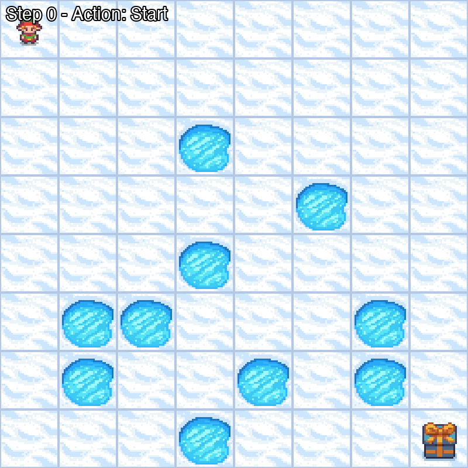

# Markov Decision Process - FrozenLake Optimization

A reinforcement learning project that implements and compares random policy evaluation with value iteration to solve the FrozenLake environment using Markov Decision Processes.

## Demo



## Overview

This project demonstrates two approaches to finding optimal policies in a stochastic environment:

### Random Policy Evaluation

- Generates 10 random policies with actions {0, 1, 2, 3} for each of the 64 states in an 8x8 grid
- Evaluates each policy across 100 experiments of 10,000 episodes each
- Identifies and visualizes the top 2 performing policies based on goal-reaching frequency
- Provides statistical analysis including mean success rate, standard deviation, and average steps to goal

### Value Iteration (Optimal Policy)

- Implements the Bellman optimality equation to compute the optimal value function
- Iteratively updates state values until convergence threshold is reached
- Extracts the optimal policy from the converged value function
- Includes visual simulation and comprehensive performance metrics

## Requirements

- Python 3.7+
- gymnasium
- numpy
- matplotlib

## Installation

1. Clone this repository:

```bash
git clone <your-repo-url>
cd "Markov Decision Process"
```

2. Install the required dependencies:

```bash
pip install gymnasium numpy matplotlib
```

## Usage

Run the complete analysis:

```bash
python main.py
```

This will execute both parts of the project:

- **Part 1**: Random policy evaluation and comparison
- **Part 2**: Value iteration to find the optimal policy with visual simulation

### Running Individual Components

To run only the tutorial/helper functions:

```bash
python tutorial.py
```

## Project Structure

```
├── main.py          # Main implementation with policy evaluation and value iteration
├── tutorial.py      # Helper functions for policy generation and experimentation
├── requirements.txt # Project dependencies
└── README.md        # This file
```

## Results

The project outputs:

- Density histograms showing goal-reaching distribution for top policies
- Statistical metrics (mean, standard deviation, average steps)
- Visual and CLI simulations of the optimal policy
- Convergence information for value iteration

## Environment

This project uses the FrozenLake-v1 environment from Gymnasium:

- **Grid Size**: 8x8 (64 states)
- **Actions**: 4 (Left, Down, Right, Up)
- **Slippery**: True (stochastic transitions)
- **Goal**: Navigate from start to goal while avoiding holes
